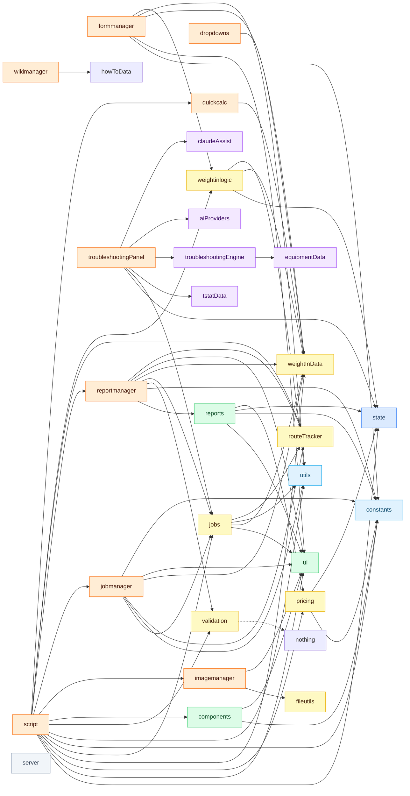
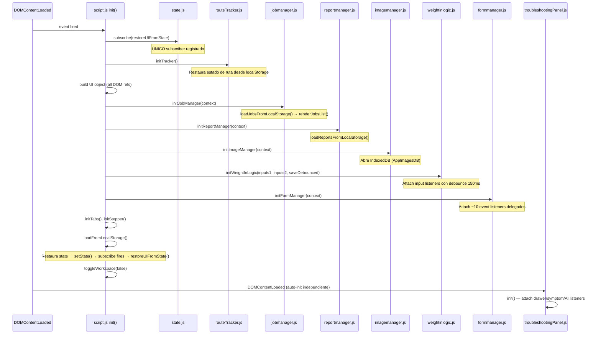
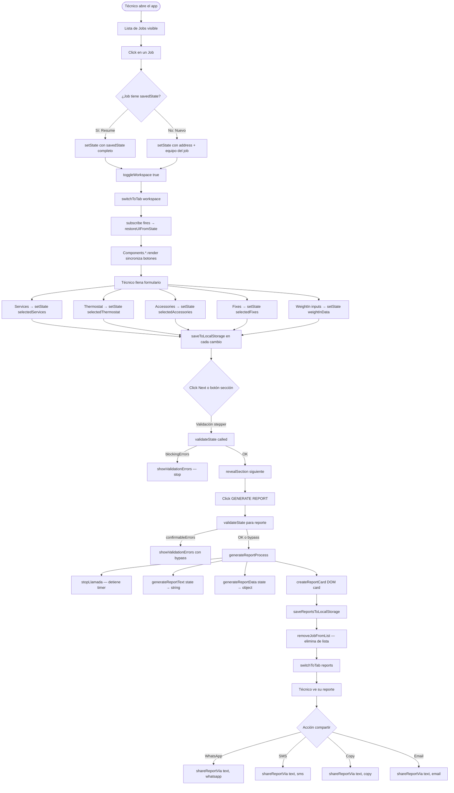
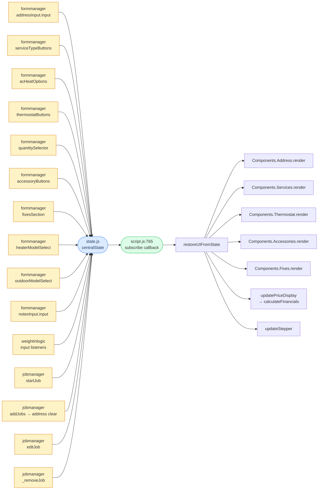
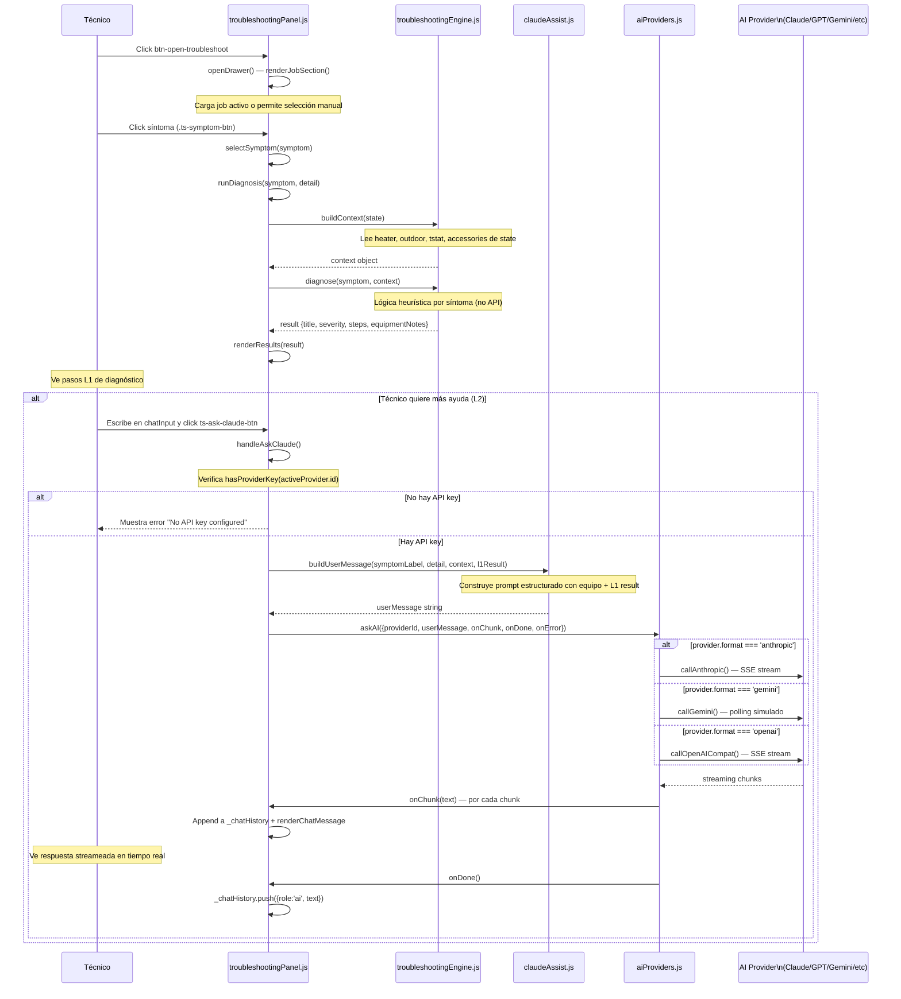

# App Flow — HVAC Field Ops

Diagramas Mermaid de los flujos principales del app.  
Renderizable en: [mermaid.live](https://mermaid.live) o cualquier editor con soporte Mermaid.

---

## Diagrama 1 — Dependencias de Módulos (imports estáticos)

---

## Diagrama 2 — Secuencia de Inicialización del App

---

## Diagrama 3 — Flujo Principal: Job → Completar → Reporte

---

## Diagrama 4 — Mapa de Mutaciones de Estado

---

## Diagrama 5 — Flujo de Troubleshooting y AI

---

## Diagrama 6 — Arquitectura de Storage (3 tiers)

```mermaid
graph TB
    classDef lsNode fill:#fef9c3,stroke:#eab308
    classDef idbNode fill:#e0f2fe,stroke:#0ea5e9
    classDef sqlNode fill:#f3e8ff,stroke:#a855f7
    classDef writerNode fill:#dcfce7,stroke:#22c55e,color:#14532d
    classDef readerNode fill:#ffedd5,stroke:#f97316,color:#431407

    subgraph LS["💾 localStorage (Browser)"]
        LS1["completionState\nSTO_KEYS.STATE"]:::lsNode
        LS2["completionReports\nSTO_KEYS.REPORTS"]:::lsNode
        LS3["jobsArray\nSTO_KEYS.JOBS"]:::lsNode
        LS4["lastActiveJobAddress\nSTO_KEYS.ACTIVE_JOB"]:::lsNode
        LS5["app-theme\n⚠️ sin constante"]:::lsNode
        LS6["route_tracker_state\n⚠️ sin constante"]:::lsNode
        LS7["wiki_favorites\n⚠️ sin constante"]:::lsNode
        LS8["ts_ai_key_{provider}\n14 keys posibles"]:::lsNode
        LS9["ts_ai_active_provider"]:::lsNode
        LS10["ts_claude_api_key\n⚠️ LEGACY + ts_ai_key_claude"]:::lsNode
    end

    subgraph IDB["🗄️ IndexedDB (Browser)"]
        IDB1["AppImagesDB\n→ store: 'images'\nkey: {addr_prefix}_{label}"]:::idbNode
    end

    subgraph SQL["🏛️ SQLite — dashboard.db (Server)"]
        SQL1[jobs]:::sqlNode
        SQL2[job_items]:::sqlNode
        SQL3[job_edits]:::sqlNode
        SQL4[inventory]:::sqlNode
        SQL5[dispatch_jobs]:::sqlNode
        SQL6[route_times]:::sqlNode
    end

    %% Escritores
    W_SCRIPT["script.js\nsaveToLocalStorage"]:::writerNode
    W_JM["jobmanager.js\nsaveJobsToLocalStorage"]:::writerNode
    W_RM["reportmanager.js\nsaveReportsToLocalStorage"]:::writerNode
    W_RT["routeTracker.js\n_save"]:::writerNode
    W_WIKI["wikimanager.js\nfavorites toggle"]:::writerNode
    W_AI["aiProviders.js\nsaveProviderKey"]:::writerNode
    W_IMG["imagemanager.js\nsaveImageToDB"]:::writerNode
    W_IMPORT["POST /api/import\n(server.js)"]:::writerNode

    W_SCRIPT -->|write| LS1
    W_JM -->|write| LS3
    W_RM -->|write| LS2
    W_RT -->|write| LS6
    W_WIKI -->|write| LS7
    W_AI -->|write| LS8
    W_IMG -->|write| IDB1
    W_IMPORT -->|write| SQL1
    W_IMPORT -->|write| SQL2
    W_IMPORT -->|write| SQL6

    %% Lectores
    R_SCRIPT["script.js\nloadFromLocalStorage"]:::readerNode
    R_JM["jobmanager.js\nloadJobsFromLocalStorage"]:::readerNode
    R_RM["reportmanager.js\nloadReportsFromLocalStorage"]:::readerNode
    R_IMG["imagemanager.js\ngetImageFromDB"]:::readerNode
    R_DASH["dashboard.html\nfetch /api/*"]:::readerNode

    LS1 -->|read| R_SCRIPT
    LS3 -->|read| R_JM
    LS2 -->|read| R_RM
    IDB1 -->|read| R_IMG
    SQL1 -->|read| R_DASH
    SQL2 -->|read| R_DASH
    SQL3 -->|read| R_DASH
    SQL4 -->|read| R_DASH

    %% Separación arquitectónica
    note1["⚠️ index.html NO accede\na SQL nunca — 100% offline"]

    style note1 fill:#fecaca,stroke:#ef4444,color:#7f1d1d
```

---

## Hallazgos de Auditoría Rápida

| ID | Tipo | Severidad | Archivo | Descripción |
|----|------|-----------|---------|-------------|
| AF-001 | Dead Code | Baja | `claudeAssist.js:144` | `askClaude()` con `fetch()` nunca llamada — reemplazada por `aiProviders.askAI()` |
| AF-002 | Duplicado | Media | `aiProviders.js:239` + `claudeAssist.js:36` | `buildSystemPrompt()` definida en ambos archivos |
| AF-003 | Duplicado | Baja | `troubleshootingPanel.js` vs `ui.js` | `showToastLocal` local vs `showToast` exportada |
| AF-004 | Layer Violation | Media | `jobs.js:66-667` | `renderJobsList` (500 líneas DOM) en módulo de persistencia |
| AF-005 | Riesgo | Media | `dropdowns.js:8-9` | DOM queries ejecutadas a nivel de módulo, sin init() |
| AF-006 | Missing Constant | Baja | `wikimanager.js`, `routeTracker.js`, `ui.js` | 3+ keys localStorage sin registrar en `STORAGE_KEYS` |
| AF-007 | Arquitectura | Alta | `server.js` (40+ endpoints) | El app principal no usa el backend — cero impacto al optimizarlo |
| AF-008 | Single Point of Failure | Alta | `script.js:765` | Un único `subscribe()` maneja TODA la reactividad UI |
| AF-009 | Seguridad | Media | `aiProviders.js` | API keys en localStorage — vulnerable a XSS |
| AF-010 | Key Duplicada | Baja | `claudeAssist.js` vs `aiProviders.js` | Dos keys distintas para Claude API (`ts_claude_api_key` legacy vs `ts_ai_key_claude`) |

Ver detalles completos y recomendaciones en [app-map.json](./app-map.json) → `auditFindings[]`.
